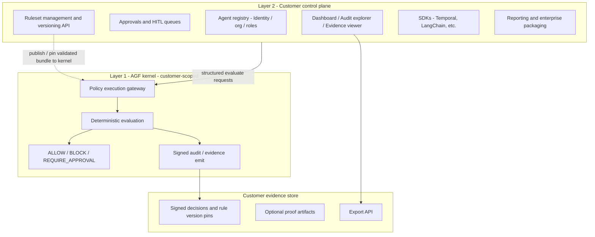

# AGF kernel + control plane: competitive closure plan

## Confirmed deployment model (plan baseline)

**Per production customer: one isolated runtime environment** + that customer’s **dedicated (customer-scoped) AGF kernel** + that customer’s **control plane** (including the **ruleset management API**—see below) + a **dedicated customer evidence and proof boundary** (evidence store).

**Isolation is not “always one cluster” as a hard rule, but the sentence that matters is:** *one isolated runtime environment per production customer.* The concrete form depends on **assurance tier** and customer preference: e.g. **dedicated cluster**, **dedicated namespace with strong isolation**, or a **dedicated tenant stack** in a multi-tenant product substrate. For **regulated** buyers, a **dedicated cluster / dedicated environment** is usually the **cleanest** story; lower tiers may accept lighter isolation. **Directionally** this matches dedicated Kubernetes, but the **authoritative** phrasing is **isolated runtime per customer**, not a single deployment pattern.

The engine is **already fit** to act as the deterministic enforcement kernel: `cargo test` passes for deterministic evaluation, ARSL parsing/validation, signed audit chain, `/evaluate`, `/evaluate-entity`, `/public-key`, and audit integrity tests.

**Product category and layers (authoritative):**

- **Category:** **Agentic AI Trust Platform** — *enterprise product surface* (register, govern, approve, audit).
- **AGF = deterministic enforcement kernel** — *what agents may do before execution* (ALLOW / BLOCK / REQUIRE_APPROVAL), **not** the whole product.
- **Control plane** = the **enterprise product surface** (workflows, identity/org, ruleset governance, operator UX).
- **Evidence store** = **audit and proof boundary** (customer-owned: signed material, not generic app logs).

**Authoritative one-liner (messaging / homepage-class):**  
*An Agentic AI Trust Platform that lets enterprises **register, govern, approve, and audit** AI agents, with **AGF as the deterministic enforcement kernel** that **decides what agents are allowed to do before execution**.*

**Sovereignty (why buyers accept this shape):** each customer controls their own **ruleset lifecycle** (via control plane), **evaluation and signing boundary** (kernel + keys), **evidence** (dedicated store, export), and **posture**—without another tenant’s policy, keys, or evidence **mixed** into the same **kernel and evidence** trust boundary.

**Critical nuance — multi-tenancy:** **Do not** make the AGF kernel multi-tenant internally. Keep the kernel **single-tenant and customer-scoped** per deployment. This protects **audit clarity**, **key ownership**, and **clear policy/evidence boundaries**. If multi-tenancy exists for a product SKU, it belongs in the **control plane only** (or above it), **not** in the deterministic kernel.

### Recommended customer environment shape

```text
Customer Environment
├─ Customer Control Plane
│  ├─ agent registry
│  ├─ users / roles / org config
│  ├─ approvals / HITL
│  ├─ dashboard / audit explorer
│  └─ ruleset management API
│
├─ AGF Enforcement Kernel
│  ├─ deterministic ALLOW / BLOCK / REQUIRE_APPROVAL
│  ├─ consumes pinned, versioned, validated rule bundles only
│  ├─ signed audit evidence to evidence boundary
│  └─ isolated runtime (K8s profile / tier varies)
│
└─ Customer Evidence Store
   ├─ signed decisions
   ├─ rule versions
   ├─ proof artifacts
   └─ export API
```

**Ruleset API placement (authoritative):** the **ruleset management API** lives in the **control plane**, **not** in the kernel. The **control plane** handles **upload, review, versioning, approval, and publication** of rules. The **AGF kernel** **only consumes** **pinned, versioned, validated** rule bundles (compile/validate on publish path, load into the kernel for execution). This keeps the kernel small and the governance story legible to auditors.

**Evidence store (first-class, not “logs”):** treat the evidence boundary as a **dedicated subsystem**: **signed decisions**, **rule-version pins**, **audit chain** material, **optional** proof artifacts (future / premium), and **export APIs**—a **customer-owned** audit and proof surface, not a dump of application logs.

**MVP and proof / ZK / TEE:** the **MVP must not** depend on ZK proofs or hardware attestation. **Live truth today** = **deterministic execution** + **signed audit** + **isolated runtime** profile. **ZK / TEE** (or similar) ship as **later premium assurance modules** once the baseline is sellable; avoid coupling MVP buyers to unready cryptography.

**Next concrete step (repo artifacts):** land this plan as **documentation and specs in the repo**—not only narrative:

1. **Customer-environment blueprint** (isolation tier options, boundaries, key ownership)
2. **API contracts** (control plane ruleset lifecycle; kernel **evaluation** gateway; evidence **export**; org boundary; HITL hooks)
3. **Ruleset lifecycle spec** (states: draft → review → approve → publish; what “validated bundle” means for the kernel)
4. **Evidence schema** (signed decisions, version pins, chain, optional proofs, export shape)
5. **MVP control-plane module list** (which surfaces ship in v1)

---

## Strategic framing (center of gravity)

**Do not copy OpenBox’s center of gravity.** Compete by making **AGF the center of gravity** and adding only the product layers that make it **purchasable** and **operable** without replacing deterministic enforcement with softer abstractions.

**AGF is:** deterministic policy engine, pre-execution enforcement layer, audit/proof kernel, and hard security boundary.

**The new platform layer is:** operator experience and enterprise product—control plane, dashboard, HITL/approvals, SDKs/integrations, identity/tenant/org, reporting, and GTM packaging.

**Why this beats rebuilding:** dashboards, admin panels, audit UIs, workflow queues, and integration SDKs are buildable by many teams; a credible **compliance kernel** with real differentiation is not. **Wrap the engine; do not replace it** with a generic “AI trust” stack.

**Customer deployment model (confirmed):** the buyer has **an isolated runtime per production customer** (form varies by **assurance tier**; regulated → prefer **dedicated environment/cluster**). **Ruleset** lifecycle (upload, review, version, approve, publish) is entirely **control plane**; the kernel receives **only pinned, validated bundles**. Workloads call a **stable policy execution gateway** on the **dedicated, customer-scoped AGF** instance. The **evidence store** is a **first-class customer boundary** (not generic logging). The **verdict path stays** clearly bounded in a **single-tenant kernel**; multi-tenancy, if any, is **only** above the kernel.

---

## Two-layer architecture (authoritative split)

The diagram below is **logical**. Physically, **per customer**, the **evidence store** is a separate sub-system (own storage + export API); the kernel **writes** auditable output that lands there, while the **control plane** indexes and serves operator UX.



### Layer 1: AGF kernel (narrow, opinionated)

**Responsibilities:** evaluate structured inputs against **published, pinned, validated** rule bundles; return `ALLOW` / `BLOCK` / `REQUIRE_APPROVAL`; emit deterministic, auditable evidence; stay isolated, testable, tamper-resistant.

**Do not overload the kernel with:** trust scores, UI logic, business workflow orchestration, **ruleset upload or review**, CRM-style enterprise features, or probabilistic “judgment” inside the hot path. **No ruleset management APIs here**—only **evaluation** and **evidence emit** to the customer boundary.

### Layer 2: Governance control plane (competitive with OpenBox-style *product*)

**Responsibilities:** agent registry; org/user/role (and, if applicable, product-level **tenant** or **org** scoping) **in this layer only**; **ruleset management API** (upload, review, versioning, **approval to publish**); **publication of validated bundles** the kernel can load; approvals queue; dashboard and **audit / evidence** explorer; framework integrations; compliance reporting. **The kernel does not** host upload or governance workflow for rules; it **consumes** what the control plane **pins and publishes**.

### Customer evidence store (not optional icing)

**First-class boundary:** same customer scope as the kernel. Holds **signed decisions**, **rule-version pins**, **audit chain** references/links, **optional** proof artifacts (later / premium), and **export** surfaces for compliance teams. This is the **audit and proof boundary**—treat it as product, not an implementation detail of “logging.”

This matches what already exists as narrative on [website/src/pages/ArchitecturePage.tsx](website/src/pages/ArchitecturePage.tsx) and [docs/WHITEPAPER.md](docs/WHITEPAPER.md) (two-layer model); the plan is to **make that split obvious in product, docs, and ship order**, not just copy.

---

## “Is the engine enough?” — five kernel capabilities

The kernel is sufficient as the backbone if it reliably:

1. Accepts **structured requests** from an external service (control plane or app).
2. **Evaluates rules deterministically** (reproducible outcomes for same inputs + ruleset version).
3. Returns a **machine-usable decision** (verdict + structured metadata).
4. Emits **auditable evidence** (signed/hash-chained; export hooks as needed).
5. Stays **isolated** from app/control-plane concerns (no feature creep in the verdict path).

**Optional additions *at the engine boundary* (not bloat):** stable API surface; versioned policy execution contract; structured decision and execution-metadata schemas; evidence export hooks; thin adapter layer for SDKs; rule lifecycle *tooling* that targets compilation/packaging (orchestrated from control plane, math still in kernel).

**ZK/TEE/advanced attestation:** **not** in MVP. Package **after** baseline is shipped and messaged. **MVP** truth path = deterministic evaluation + **signed** audit + **isolated** runtime. Premium modules add **proof** or **attestation** without rewriting the core story.

---

## What not to do (explicit)

- **Do not** turn AGF into a monolithic all-in-one app; that weakens determinism, verifiability, attack-surface story, and conceptual clarity.
- **Do not** add **multi-tenancy inside the kernel**; one production kernel instance serves **one customer** scope; “many teams” is a **control-plane** concern.
- **Do not** “win” by aping OpenBox’s entire narrative; win on **deterministic adjudication** and **governance outside the LLM**, with **OpenBox-comparable operability** around the kernel.
- **Do not** fold trust-scoring or orchestration into the kernel to chase parity.
- **Do not** **couple the MVP to ZK, TEE, or attestation** as a hard requirement; those are **later assurance tiers**.
- **Do not** put **ruleset upload, review, or publication workflow** in the kernel — **control plane only**; kernel **only** runs on **published, pinned bundles**.

---

## Mapping the OpenBox comparison to this model

| Gap (from your analysis) | Primary fix (Layer 1 vs 2) | Notes |
|-------------------------|----------------------------|--------|
| Product surface / category clarity | L2 + messaging | **Authoritative one-liner** (see “Confirmed deployment model”): register, govern, approve, audit + AGF before execution. |
| UX / dashboard | L2 | Dashboard, audit explorer, policy lifecycle, evidence viewer. |
| Workflows / approvals (legibility) | L2 | First-class HITL; kernel only returns `REQUIRE_APPROVAL` + evidence. |
| Integrations / ecosystem | L2 + thin adapters | Public catalog: start Temporal + LangChain/LangGraph; align with [ArchitecturePage](website/src/pages/ArchitecturePage.tsx) “Temporal first” line. |
| Identity / cross-org trust | L2 (mostly) | Strong **internal** org/agent identity and delegation; federated/DID as roadmap story unless product-ready—avoid over-claiming. |
| Proof vs marketing | L1 contract + L2 presentation | **Live today / benchmarked / roadmap** (whitepaper already distinguishes default path vs ZK; surface that in buyer docs). |
| Sales-readiness / GTM | L2 + packaging | API-first eval + “bring your environment”; optional free/dev tier if strategy allows. |
| Compliance breadth | Positioning + modules | Deeper kernel vs broader modules—avoid pretending breadth without shipping. |
| Deployment maturity | L2 packaging + docs | Customer env + ruleset load + API; **standalone** “AGF kernel” deployment story, NeuroCluster as optional host. |

---

## Priority matrix (summary)

- **Must-fix (for “buyable” parity):** control plane **surfaces** (dashboard, approvals, **ruleset governance API**, audit / **evidence** exploration); **stable evaluation API** and **versioned, published** rules to kernel; **integration** spine (2 stacks minimum); **credibility** clarity — **MVP = deterministic + signed + isolation**, ZK/TEE labeled later; **category** + **one-liner**; **GTM** path consistent with **isolation tier** story.
- **Should-fix:** org/tenant/RBAC, reporting exports, identity/delegation narrative, expanded integration catalog, enterprise packaging/SLA hooks.
- **Ignore or defer (unless strategy shifts):** matching OpenBox’s full federated “trust network” **marketing** before product; building **trust-score theater** in-kernel; feature parity with every adjacent compliance module up front.

---

## Recommended build order (highest leverage)

1. **Customer environment blueprint** (repo doc) — **isolated runtime per production customer**; **assurance tier** options (dedicated stack vs namespace/tenant isolation); control plane + **customer-scoped** AGF kernel + **first-class evidence store**; **ruleset lifecycle in control plane only**; **no** kernel multi-tenancy; key and evidence **ownership** clear.
2. **Keep AGF kernel** narrow; freeze responsibility boundaries; keep existing `cargo test` / HTTP contract as the quality bar.
3. **Thin policy gateway** — ruleset version pinning, decision + evidence schema; align with [agf-sp1/server](agf-sp1) and [docs/RUNTIME_VALIDATION.md](docs/RUNTIME_VALIDATION.md) (`/evaluate`, `/evaluate-entity`, `/public-key`).
4. **Ruleset lifecycle + evidence** — control plane **governance and publish** path; **kernel** load of **published bundles** only; evidence store **schema + export** (contracts as repo artifacts first).
5. **Identity/org boundary + HITL hooks** in control plane (orchestration only; kernel still returns `REQUIRE_APPROVAL` + evidence).
6. **Dashboard + approvals** (HITL as product, kernel as verdict).
7. **Integration SDKs** (Temporal, then LangChain/LangGraph) — “connect without rewriting core agent logic” story.
8. **Reporting** (compliance team exports) on top of evidence store and control plane metadata.
9. **Advanced proof / ZK / attestation packaging** — **premium** / later assurance; **not** on the MVP critical path; incremental modules, not a kernel rewrite.

**Repo touchpoints for narrative and alignment:** [website/src/pages/HomePage.tsx](website/src/pages/HomePage.tsx) (hero already mixes control plane + kernel), [website/src/pages/ArchitecturePage.tsx](website/src/pages/ArchitecturePage.tsx), [docs/ARSL_SPEC.md](docs/ARSL_SPEC.md), [docs/WHITEPAPER.md](docs/WHITEPAPER.md), [docs/BUSINESS_PLAN_2026.md](docs/BUSINESS_PLAN_2026.md) (roadmap already sketches dashboard/API—tie explicitly to the two layers).

---

## MVP scope suggestion (concrete)

- **Kernel:** versioned `POST` evaluate (or equivalent), multi-vertical/atomic bundle as in whitepaper, signed audit chain, documented isolation posture; **one customer scope per deployed kernel** (no internal multi-tenancy).
- **Control plane (MVP):** one dashboard (policy versions + recent verdicts), one approvals queue, one audit explorer, **ruleset management API** (upload/version/pin), agent registration (minimal), first integration (Temporal **or** LangChain).
- **Customer evidence store (MVP):** first-class: **signed decisions**, **rule-version pins**, **audit chain** material, and **export**; **not** “just logs.” **Optional** proof storage remains **out of MVP scope** or clearly **stubs for future** premium tier—not a dependency to ship the product.
- **Docs:** one-liner; **three-box** (control plane / **customer-scoped** kernel / **evidence boundary**); **isolation tier** one-pager; integration quickstart; **live today** = deterministic + signed + isolated; ZK/TEE = **roadmap / premium**, not MVP gate.

This preserves the **moat** (deterministic kernel) while making the **same comparison to OpenBox** feel fair: **legibility and operability** on par, **differentiation** in the **engine**, not the sidebar count.
